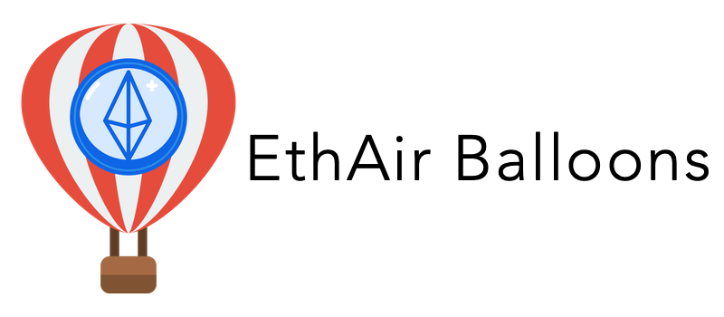

# EthAir Balloons

A strictly typed ORM library for Ethereum blockchain.
It allows you to use Ethereum blockchain as a persistent storage in an organized and model-oriented way <strong>without writing custom complex Smart contracts</strong>.


<strong>Note:
As transaction fees may be huge, it is strongly advised to only deploy EthAir Balloons models in private Ethereum blockchains or locally using
`ganache-cli` .
</strong>


# Installation
```
npm i --save ethAirBalloons
```

# Setup and example

```JS
var ethAirBalloons = require('ethAirBalloons');
var savePath = path.resolve(__dirname + '/contracts');

var ethAirBalloonsProvider = ethAirBalloons('http://localhost:8545', savePath); 
//ethereum blockchain provider URL, path to save auto generated smart contracts

var Car = ethAirBalloonsProvider.createSchema({
		name: "Car",
		contractName: "carsContract",
		properties: [
		    {   name: "model",
				type: "bytes32",
				isPrimaryKey: true
			},
			{ 
			    name: "engine",
			    type: "bytes32",
			},
			{   name: "cylinders",
				type: "uint"
			}
		]
	});

```

As you can see you can very easily create a new ethAirBaloons provider (line 3) by setting only 2 arguments.
1) the URL of the Ethereum blockchain provider that you want to use
(in the example it is set to a local `ganache-cli` provider),
2) the path where you want to save the automatically generated smart contracts of your models.

After you create the provider you can create new data schemas using the `createSchema()` function and pass the schema details in JS object format.
Of course you can (an it is advised) keep the schema definitions in separate .JSON files and then import them using the `require()` statement in the top of your file.


 `createSchema()` returns a  `Schema` object.
 In order to successfully initialize a `Schema` object, *only one* property
 of the schema definition must have `isPrimaryKey` field set to `true` (as shown in the example above)
 and the `type` field must be set to one of the legal [Solidity data types](https://solidity.readthedocs.io/en/v0.5.3/types.html).

 # Functions of `Schema` object

As all blockchains have an asynchronous nature, all functions in the library return a callback function.
After you initialize a `Schema`, you can call the following functions:

deploy()
--------

save()
------

find()
------

findById()
----------

deleteById()
------------

updateById()
------------